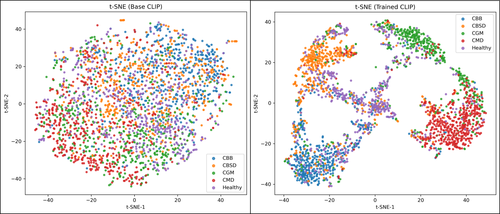
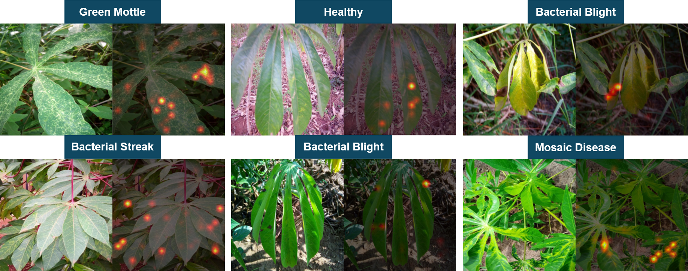

# PLA-CLIP

Code for **Progressive Layer Activation CLIP for Few-Shot and Generalizable Cassava Disease Recognition**.

This repository is intentionally focused on the scripts needed to reproduce the main CLIP experiments from the paper:

- zero-shot baseline CLIP evaluation;
- baseline CLIP fine-tuning, which is likely the most useful starting point for many researchers;
- PLA-CLIP, the progressive layer activation method proposed in the paper.

No trained checkpoints are included. The code trains from `openai/clip-vit-base-patch16` and saves checkpoints locally when run.


The framework adapts CLIP to cassava disease recognition under few-shot supervision. Images are paired with disease-specific text prompts, and the model is evaluated through image-text similarity after training.

## Paper

- **Title:** Progressive Layer Activation CLIP for Few-Shot and Generalizable Cassava Disease Recognition
- **Venue:** ICCAE 2026
- **Authors:** Muhammad Shafay, Muhammad Owais, Divya Velayudhan, Taimur Hassan, Irfan Hussain, Naoufel Werghi
- **PDF:** [`paper/PLA-CLIP.pdf`](paper/PLA-CLIP.pdf)

## Method Summary

The paper addresses few-shot cassava leaf disease recognition using CLIP. The main CD1 training setup uses only 43 images per class, with the remaining images reserved for testing.

The baseline fine-tuning script trains CLIP with a classification head and fixed seeds. This is a simple and practical baseline for researchers who want to adapt CLIP to cassava disease classification.

PLA-CLIP progressively activates CLIP ViT-B/16 vision transformer blocks during training:

- epochs 1-10: T9-T11
- epochs 11-20: T6-T11
- epochs 21-30: T3-T11
- epochs 31-50: T0-T11

The text encoder stays frozen, and training uses a CLIP-style image-text contrastive objective with disease prompts.

## Paper Figures

### Feature Embeddings



The t-SNE visualization in the paper compares pretrained CLIP features with progressively adapted PLA-CLIP features on the CD1 test set. The figure is included here to make the repository landing page easier to connect with the paper narrative.

### Attention Visualization



The attention visualization highlights the image regions used by the adapted model when classifying cassava leaf diseases. These qualitative examples are provided for interpretability and should be read together with the paper.

## Code Overview

Only three scripts are part of the cleaned release:

| Script | Purpose | When to use it |
| --- | --- | --- |
| `scripts/baseline_clip_zeroshot.py` | Evaluates pretrained CLIP directly using cassava disease prompts. No training is performed. | Use this as the simplest baseline and a sanity check for dataset formatting. |
| `scripts/baseline_clip_finetuning.py` | Fine-tunes CLIP on CD1 using 43 images per class by default, fixed seeds, and a classification head. | Recommended starting point for most users because it is straightforward and useful beyond this paper. |
| `scripts/pla_clip.py` | Trains the proposed Progressive Layer Activation CLIP method with staged ViT layer activation. | Use this to reproduce the main PLA-CLIP method from the paper. |

## Repository Structure

```text
PLA-CLIP/
  README.md
  LICENSE
  requirements.txt
  environment.yml
  paper/
    PLA-CLIP.pdf
  Figures/
    block diagram.png
    tsne.png
    attention.png
  scripts/
    baseline_clip_zeroshot.py
    baseline_clip_finetuning.py
    pla_clip.py
  data/
    README.md
  checkpoints/
    README.md
  results/
    README.md
```

The original working `codes/` folder is preserved locally but ignored by Git. It is not part of the cleaned public repository.

## Installation

```bash
python -m venv .venv
source .venv/bin/activate  # Windows: .venv\Scripts\activate
pip install -r requirements.txt
```

For GPU training, install the PyTorch build that matches your CUDA version if the default package is not suitable.

## Dataset Preparation

Datasets are not included. Place images in this layout:

```text
data/
  CD1/
    Images/
      CBB/
      CBSD/
      CGM/
      CMD/
      Healthy/
  CD2/
    Images/
      CBSD/
      CMD/
      Healthy/
  CD3/
    Images/
      CBB/
      CMD/
      Healthy/
```

Dataset references from the paper:

- **CD1:** Cassava Leaf Disease Classification, Kaggle.
- **CD2:** Makerere University Cassava Image Dataset, Harvard Dataverse.
- **CD3:** Cassava Leaf Disease Dataset, Mendeley Data.

TODO: Add author-approved download and preprocessing instructions.

## Running the Code

Run all commands from the repository root.

### 1. Zero-Shot CLIP Baseline

Evaluates pretrained CLIP with class prompts on CD1/CD2/CD3:

```bash
python scripts/baseline_clip_zeroshot.py --data-root data --datasets CD1 CD2 CD3
```

Outputs are saved under:

```text
results/zero_shot_clip/
```

### 2. Baseline CLIP Fine-Tuning

This is the recommended baseline script to start with. It trains CLIP fine-tuning scenarios using the provided seed and 43 images per class by default.

```bash
python scripts/baseline_clip_finetuning.py \
  --dataset-path data/CD1/Images \
  --output-dir results/baseline_clip_finetuning \
  --checkpoint-dir checkpoints \
  --images-per-class 43 \
  --batch-size 32 \
  --seed 42
```

Expected outputs:

```text
results/baseline_clip_finetuning/clip_finetuning_results.json
checkpoints/clip_finetuned_10_epochs.pth
checkpoints/clip_finetuned_50_epochs.pth
checkpoints/clip_finetuned_50_epochs_low_lr.pth
```

### 3. PLA-CLIP

Trains the progressive layer activation method from the paper.

```bash
python scripts/pla_clip.py \
  --dataset-path data/CD1/Images \
  --output-dir results/pla_clip \
  --checkpoint-dir checkpoints \
  --images-per-class 43 \
  --batch-size 16 \
  --epochs 50 \
  --learning-rate 1e-5 \
  --seed 43
```

Expected outputs:

```text
results/pla_clip/pla_clip_results.json
checkpoints/pla_clip.pth
```

## Checkpoints

No pretrained PLA-CLIP checkpoints are provided in this repository. Reviewers and researchers can run the scripts above to train their own checkpoints from the public CLIP backbone.

TODO: Add checkpoint links only if the authors decide to release trained weights.

## Citation

Formal proceedings metadata was not available in the submitted PDF. Please update this BibTeX entry before final release:

```bibtex
@inproceedings{shafay2026placlip,
  title = {Progressive Layer Activation CLIP for Few-Shot and Generalizable Cassava Disease Recognition},
  author = {Shafay, Muhammad and Owais, Muhammad and Velayudhan, Divya and Hassan, Taimur and Hussain, Irfan and Werghi, Naoufel},
  booktitle = {Proceedings of ICCAE},
  year = {2026},
  note = {TODO: verify proceedings title, pages, publisher, and DOI}
}
```

## License

TODO: Choose an explicit open-source license before public release. The current `LICENSE` file is a placeholder.
